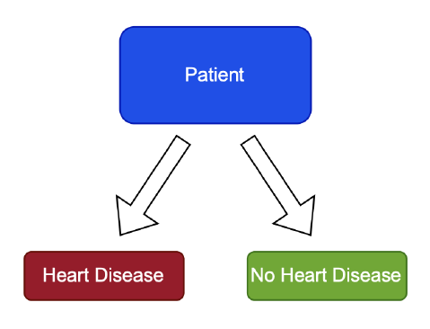
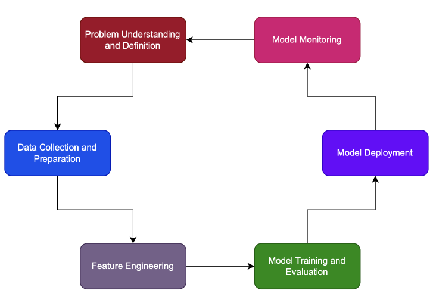
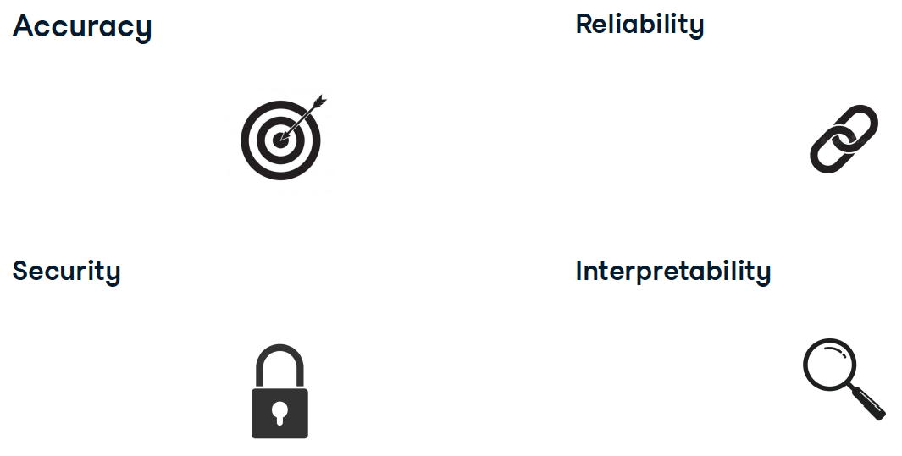
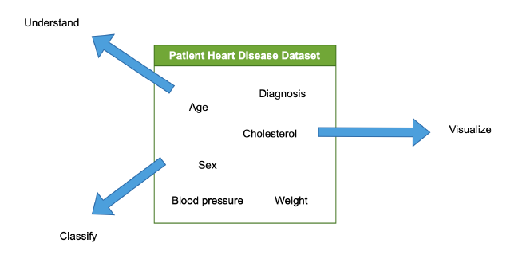
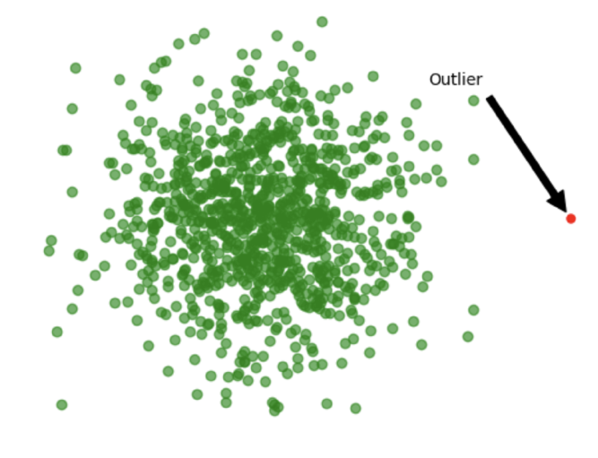

```{r setup, include=FALSE}
# xaringanExtra::use_scribble() ## Draw on slides. Requires dev version of xaringanExtra.
library(tidyverse)
library(hrbrthemes)
library(fontawesome)
```


class: title-slide   


# Econ 725: Computer Programming and Data Management in Economics 

## Applied ML: Design and Exploration

<p align=center>
Marcelo Ortiz-Villavicencio
</p>
<div style="margin-top: -.7cm;"></div>
<p align=center>
Emory University
</p>
</p>
<br>
<p align=center>
Fall 2024
</p>

---
class: center, middle

# Designing an end-to-end machine learning model

<html><div style='float:left'></div><hr color='#EB811B' size=1px width=1100px></html>

---

# The case study

- Suppose that you are a data scientist working for Emory Healthcare.
- The cardiology department is interested in using machine learning to predict the likelihood of a patient having a heart attack.
- You are tasked with designing an end-to-end machine learning model that can predict the likelihood of a patient having a heart attack.

<div align="center">

</div>

---
# The model's role

- Models can *inform*, but should not *make* decisions.
- Especially in healthcare, or any other high-stakes environment.

<div align="center">

</div>


---
# The machine learning lifecycle

<div align="center">

</div>

---

# Understanding end user requirements

<div align="center">

</div>

---
# Data collection

- Collect relevant data
  - Private dataset from company
  - Public dataset from Kaggle, UCI ML Repository, etc.

- Understand data and context
  - Representation and measurement
  - Potential bias

---

class: center, middle

# Exploratory Data Analysis

<html><div style='float:left'></div><hr color='#EB811B' size=1px width=1100px></html>

---
# The EDA process

- Examine and analyze the dataset.
- Understand the data and its characteristics.
- Visualize the dataset.
- Characterize / classify the dataset.

<div align="center">

</div>


---

# Class (im)balance

- Counts numbers of unique occurrences of each class (this is valid for classification tasks only).
- Class: binary presence of heart disease (1/0)
- This is so important for the model to learn the patterns in the data.

```python
heart_disease_df["target"].value_counts(normalize=True)
```


---
# Missing values

- Can lead to errors
- Unrepresentative data, biased results
- Checks for null/empty/missing values
- Applied to column or collection of columns

```python
print(heart_disease_df['oldpeak'].isnull().all())
```
---
# Outliers
.pull-left[
- Anomalous values
  - Measurement errors
  - Data entry errors
  - Rare events
- Can skew model performance
  - Model learns based on extreme values
  - Does not capture general data trend
- Sometimes can be useful:
  - Rare values
  - Detection: use boxplot or IQR
]

.pull-right[

]

---
# Visualizing our data
Visualizations show:
- General trends in data
- Missing values and outliers

Other types of visualizations:
- Kernel density estimations
- Empirical cumulative distributions
- Bivariate distributions
- Correlation matrices

```python
df['age'].plot(kind='hist')
plt.xlabel('Age')
plt.ylabel('Frequency')
plt.show()
```

---
# Goals of EDA
.pull-left[
**Understand the data**
- Are there any patterns?
- Eg: do men have higher rate of heart disease?

**Formulate hypothesis**
- What should we expect from the data?
]

.pull-right[
**Detect outliers**
- Does any data fall outside what is
acceptable?
- Are there incorrect or missing values?

**Check assumptions**
- Does what we expect line up with reality?
]

---

class: center, middle

# Data preparation

<html><div style='float:left'></div><hr color='#EB811B' size=1px width=1100px></html>
---
# Data preparation steps

.pull-left[
**Datasets normally have**
- Missing values
- Outliers
- Class Imbalances (classification tasks)
- Empty columns
- Duplicates
]

.pull-right[
**Data preparation**
- Based on insights from EDA
- Critical for model performance downstream
]

---
# Null / empty values

- Drop missing or sparse rows/columns
- Null values can break model
- Use `df.drop()` for columns
- Use `df.dropna(how='all')` for rows

```python
# count missing values
print(df['oldpeak'].isnull().sum())
# Drop empty column(s) and row(s)
columns_dropped = heart_disease_df.drop(['oldpeak'], axis='columns')
rows_and_columns_dropped = columns_dropped.dropna(how='all')
```

---
# Dealing with null / empty values

- Data cleaning / dropping values depends on EDA findings
- If given column has too many missing values:
    - Drop column
- If target column has missing values:
    - Drop rows with missing targets
    - Or treat as separate category

---
# Imputation

What to do when there are only a few missing values?

- Imputation:
    - Fill missing values with substitutes
- Strategies
    - Fill with mean or median
    - Use constant or previous value

```python
# Calculate the mean cholestrol value
mean_value = heart_disease_df['chol'].mean()
# Fill missing cholestrol values with the mean
heart_disease_df['chol'].fillna(mean_value, inplace=True)
```
---
# Advanced imputation
Advanced techniques:
- K-nearest neighbors
- SMOTE (synthetic minority oversampling technique)

```python
from sklearn.impute import KNNImputer
# Initialize KNNImputer
imputer = KNNImputer(n_neighbors=2, weights="uniform")
# Perform the imputation on your DataFrame
df_imputed['oldpeak'] = imputer.fit_transform(df['oldpeak'])
```
---
# Dropping duplicates
- Data must be clean, concise, and rich
- Redundancies are unhelpful
- Duplicates can bias or confuse model
- Look at unique identifiers as a criteria for dropping records / rows.

```python
# Drop duplicate rows
heart_disease_duplicates_dropped = heart_disease_column_dropped.drop_duplicates()
```
---

class: center, middle, thank-you-slide
# Thanks!


`r fa('link')` [marcelortiz.com](https://marcelortiz.com/)

`r fa('envelope')` [marcelo.ortiz@emory.edu](mailto:marcelo.ortiz@emory.edu)

`r fa('twitter')` [@marcelortizv](https://twitter.com/marcelortizv)


